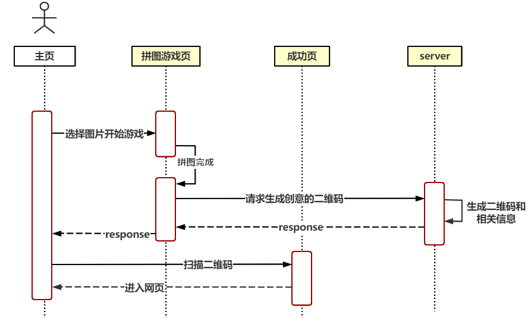

## 拼图二维码小游戏

Go语言实现的拼图二维码小游戏，在选择图片后进行拼图游戏，拼图成功后生成二维码图片。扫描二维码获得证书。

### 流程图



### 技术点

- 前端：HTML、CSS、JavaScript
- 后端：Go语言
- [go-qrcode](https://github.com/yeqown/go-qrcode)：二维码生成
- [viper](github.com/spf13/viper)：配置文件读取

### 演示地址

http://yankaka.chat:8081/static/

### 博客

- [带你用Go实现二维码小游戏（上）](https://mp.weixin.qq.com/s?__biz=MzIxNDc2ODc3MA==&mid=2247487822&idx=1&sn=f56e87f5a0b7b9da8d0d1c3680586217&chksm=97a3dca3a0d455b5a25666ce75be69409feeedd165fb363456e70d7a7487ab50d59de41ef53a#rd)

- [带你用Go实现二维码小游戏（中）](https://mp.weixin.qq.com/s?__biz=MzIxNDc2ODc3MA==&mid=2247487835&idx=1&sn=2dbb73c69242602f75573bbe14535fd6&chksm=97a3dcb6a0d455a0e872bb1d417d33fed433d235ad506c49eaa0a7a57c7541d57fc0e1eda58a#rd)

- [带你用Go实现二维码小游戏（下）](https://mp.weixin.qq.com/s/D5mDlqWnnoJruVZbq2e2SQ)

- [带你用Go实现二维码小游戏（优化篇）](https://mp.weixin.qq.com/s/jWe49UJckujsQntZ_il2jg)

### Docker build

```shell
docker build -t qrcode .

docker run -d -p 8081:8081 qrcode
```
